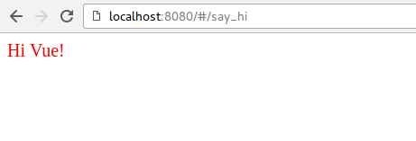

# 创建一个页面

激动人心的时刻到来了！ 接下来我们要通过自己动手，开始下一步的学习！

请各位同学务必准备好电脑。 只有一边学习一边敲代码，才能真正的看到效果。 调试代码的过程是无法脑补出来的。切记切记！

在Vuejs中创建页面需要两步：

1. 新建路由
2. 新建vue页面

## 新建路由

默认的路由文件是 `src/router/index.js`, 打开之后, 我们增加两行:

```
import Vue from 'vue'
import Router from 'vue-router'

// 增加这一行, 作用是引入 SayHi 这个component
import SayHi from '@/components/SayHi'

Vue.use(Router)
export default new Router({
  routes: [

    // 增加下面几行, 表示定义了  /#/say_hi 这个url
    {
      path: '/say_hi',
      name: 'SayHi',
      component: SayHi
    },
  ]
})
```

上面的代码中， 

```
import SayHi from '@/components/SayHi'
```

表示从 当前目录下的 `components` ，引入 `SayHi` 文件。  `@` 表示当前目录。

然后，用下面的代码来定义一个路由：

```
routes: [
    {
      path: '/say_hi',   // 对应 一个url 
      name: 'SayHi',     // Vuejs 内部使用的名称
      component: SayHi   // 对应的 .vue 页面的名字
    },
]
```

也就说，每当用户的浏览器访问  `http://localhost:8080/#/say_hi` 时， 就会渲染 `./components/SayHi.vue` 文件。

`name: 'SayHi' ` 定义了该路由在Vuejs内部的名称。 后面会对此有所解释。


## 创建一个新的Component

由于上面我们在路由中引用了component： `src/components/SayHi.vue`, 接下来，我们要创建这个文件.

代码如下:

```
<template>
  <div >
    Hi Vue!
  </div>
</template>

<script>
export default {
  data () {
    return { }
  }
}
</script>

<style>
</style>

```

在上面的代码中： 

- `<template></template>` 代码块中,表示的是 HTML模板.  里面写的就是最普通的HTML 。 

- `<script/>`表示的是 js 代码. 所有的js代码都写在这里.  这里使用的是 EM Script.

- `<style>`表示所有的 CSS/SCSS/SASS 文件都可以写在这里.

现在,我们可以直接访问  http://localhost:8080/#/say_hi 这个链接了. 打开后，页面如下图所示：


## 为页面增加一些样式

接下来，我们可以为页面加一些样式， 让它变得好看一些:

```
<template>
  <div class='hi'>
    Hi Vue!
  </div>
</template>

<script>
export default {
  data () {
    return { }
  }
}
</script>

<style>
.hi {
  color: red;
  font-size: 20px;
}
</style>
```

注意上面代码中的　`<style>`标签，里面跟普通的CSS一样, 定义了样式。

```
.hi {
  color: red;
  font-size: 20px;
}
```

刷新浏览器，可以看到, 文字加了颜色, 如下图所示:



## 定义并显示变量

如果要在vue页面中定义一个变量,并把它显示出来,就需要事先在 `data` 中定义:

```
export default {
  data () {
    return {
      message: '你好Vue! 本消息来自于变量'
    }
  }
}
```

可以看到，上面的代码是通过 Webpack的项目来写的。 回忆一下， 原始的Vuejs中是如何定义一个变量(property) 的？

答案是：
```
var app = new Vue({
  data () {
    return {
      message: '你好Vue! 本消息来自于变量'
    }
  }
})
```

所以，我们可以认为， 之前用“原始的Vuejs”的代码中，写的 `new Vue({...})`中的代码，在webpack的框架下，都要写到 `export default { .. }` 中来。

完整的代码（`src/components/SayHi.vue`）如下所示： 

```
<template>
  <div>
    <!--  步骤2: 在这里显示 message -->
    {{message}}
  </div>
</template>

<script>
export default {
  data () {
    return {
      // 步骤1: 这里定义了变量 message 的初始值
      message: '你好Vue! 本消息来自于变量'
    }
  }
}
</script>

<style>
</style>
```

页面打开如下图所示:


