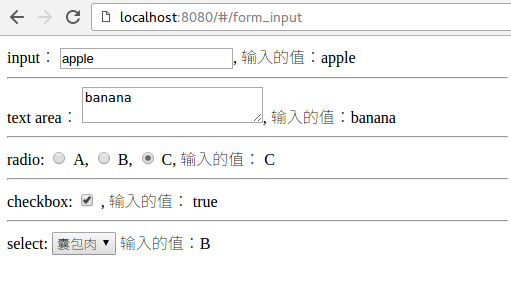

# 对于表单的处理

## 表单项: input, textarea, select 等．

使用v-model来绑定　输入项

```
<input v-model="my_value" style='width: 400px'/>
```

就可以在代码中获取到　`this.my_value`的值.


## 表单项的完整例子

```
<template>
  <div>

    input： <input type='text' v-model="input_value"/>,
    输入的值：{{input_value}}
    <hr/>
    text area： <textarea v-model="textarea_value"></textarea>,
    输入的值：{{textarea_value}}
    <hr/>
    radio:
    <input type='radio' v-model='radio_value' value='A'/> A,
    <input type='radio' v-model='radio_value' value='B'/> B,
    <input type='radio' v-model='radio_value' value='C'/> C,
    输入的值：
    {{radio_value}}
    <hr/>
    checkbox:
    <input type='checkbox' v-model='checkbox_value'
      v-bind:true-value='true'
      v-bind:false-value='false'
      /> ,
    输入的值：
    {{checkbox_value}}
    <hr/>
    select:
    <select v-model='select_value'>
      <option v-for="e in options" v-bind:value="e.value">
        {{e.text}}
      </option>
    </select>
    输入的值：{{select_value}}

  </div>
</template>

<script>
export default {
  data () {
    return {
      input_value: '',
      textarea_value: '',
      radio_value: '',
      checkbox_value: '',
      select_value: 'C',
      options: [
        {
          text: '红烧肉', value: 'A'
        },
        {
          text: '囊包肉', value: 'B'
        },
        {
          text: '水煮鱼', value: 'C'
        }
      ]
    }
  },
  methods: {
  }
}
</script>

```

在代码层面可以看出，基本都使用v-model来进行输入值的绑定．

对于select 的option, 使用　`v-bind:value`来绑定option的值.


效果如图：　



动图如下：


