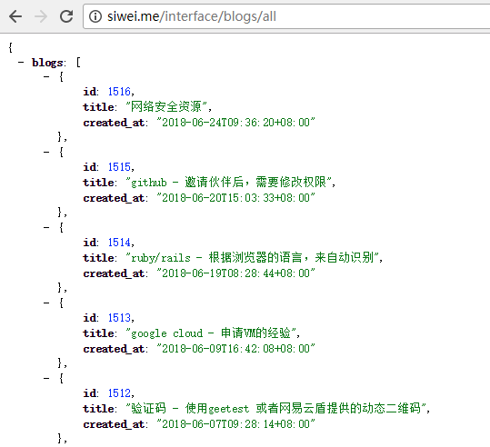
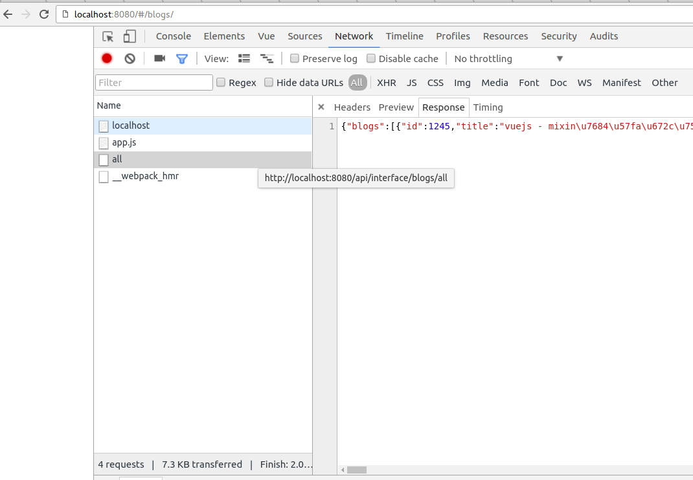

# 发送http请求

TODO:  需要加上 http resource, 在 main.js。

只要有js的地方，就要有接口。 特别是我们这样前后端分离的SPA， 几乎每个页面都要发起http请求。从后台接口读取数据，并且显示在前台页面。

这就需要用到http请求了. 

## 1. 调用http请求

vuejs 内置了对发送http请求的支持. 只需要在对应页面的script 标签内加上对应的代码就好.
例如:

我们新增一个页面,叫 "博客列表页" :  `src/components/BlogList.vue`, 它的作用是从我的个人网站(http://siwei.me) 上，读取文章的标题，并且显示出来。

代码如下:

```
<template>
  <div >
    <table>
      <tr v-for="blog in blogs">
        <td>{{blog.title }}</td>
      </tr>
    </table>
  </div>
</template>

<script>
export default {
  data () {
    return {
      title: '博客列表页',
      blogs: [
      ]
    }
  },
  mounted() {
    this.$http.get('api/interface/blogs/all').then((response) => {
       console.info(response.body)
       this.blogs = response.body.blogs
    }, (response) => {
       console.error(response)
    });
  }
}
</script>

<style >

td {
  border-bottom: 1px solid grey;
}
</style>
```

上面的代码中， 我们先看 `<script/>`代码段，

```
export default {
  data () {
    return {
      title: '博客列表页',
      blogs: [
      ]
    }
  },
  mounted() {
    this.$http.get('api/interface/blogs/all').then((response) => {
       console.info(response.body)
       this.blogs = response.body.blogs
    }, (response) => {
       console.error(response)
    });
  }
}
```

上面代码中，先是定义了两个变量：  `title`,  `blogs`, 然后定义了一个 `mounted` 方法。该方法表示当页面加载完毕后应该做哪些事情。
是一个钩子方法。 

```
this.$http.get('api/interface/blogs/all').then((response) => {
   console.info(response.body)
   this.blogs = response.body.blogs
}, (response) => {
   console.error(response)
});
```    

上面代码，是发起http请求的核心代码。 访问的接口地址是 `api/interface/blogs/all` ， 然后使用 `then`方法做下一步的事情， 
`then`方法接受两个函数作为参数，第一个是成功后干嘛，第二个是失败后干嘛。 

成功后的代码如下：  

```
this.blogs = response.body.blogs
```

然后，在对应的视图部分显示： 

```
<tr v-for="blog in blogs">
  <td>{{blog.title }}</td>
</tr>
```

## 2. 远程接口的格式

在我的服务器上，读取个人博客标题的接口我已经提前做好了，是 ：

http://siwei.me/interface/blogs/all

内容如下;

```
{
  blogs: [
    {
      id: 1516,
      title: "网络安全资源",
      created_at: "2018-06-24T09:36:20+08:00"
    },
    {
      id: 1515,
      title: "github - 邀请伙伴后，需要修改权限",
      created_at: "2018-06-20T15:03:33+08:00"
    },
    {
      id: 1514,
      title: "ruby/rails - 根据浏览器的语言，来自动识别",
      created_at: "2018-06-19T08:28:44+08:00"
    }, 
    {
      id: 1513,
      title: "google cloud - 申请VM的经验",
      created_at: "2018-06-09T16:42:08+08:00"
    },
    {
      id: 1512,
      title: "验证码 - 使用geetest 或者网易云盾提供的动态二维码",
      created_at: "2018-06-07T09:28:14+08:00"
    }
    // 更多内容。。。
  ]
}
```

在浏览器中打开后，如下图所示（使用了 jsonview 插件做了json 的代码格式化）: 



## 3. 设置 Vuejs 开发服务器的代理

正常来说， javascript在浏览器中是无法发送跨域请求的，所以我们需要在vuejs的＂开发服务器＂上做个转发配置．

修改：  `config/index.js`文件，增加下列内容：

```
module.exports = {
  dev: {
    proxyTable: {
      '/api': {        // 1. 对于所有以  "/api"　开头的url 做处理．
        target: 'http://siwei.me',   // 3. 转发到 siwei.me 上．
        changeOrigin: true,
        pathRewrite: {
          '^/api': ''  // 2. 把url中的　"/api" 去掉．
        }
      }
    },
}
```

上面的代码做了三件事：

1. 对于所有以  "/api"　开头的url 做处理．
2. 把url中的　"/api" 去掉．
3. 把新的url 请求打到　siwei.me 上．

例如：　
- 原请求：　　http://localhost:8080/api/interface/blogs/all
- 新请求：　　http://siwei.me/interface/blogs/all

注意：　以上的代理服务器内容，只能在＂开发模式＂下才能使用．在生产模式下，只能靠服务器的nginx的特性来解决js跨域问题．

修改后的 `config/index.js`文件的完整内容如下：

```
var path = require('path')

module.exports = {
  build: {
    env: require('./prod.env'),
    index: path.resolve(__dirname, '../dist/index.html'),
    assetsRoot: path.resolve(__dirname, '../dist'),
    assetsSubDirectory: 'static',
    assetsPublicPath: '/',
    productionSourceMap: true,
    productionGzip: false,
    productionGzipExtensions: ['js', 'css'],
    bundleAnalyzerReport: process.env.npm_config_report
  },
  dev: {
    env: require('./dev.env'),
    port: 8080,
    autoOpenBrowser: true,
    assetsSubDirectory: 'static',
    assetsPublicPath: '/',

    proxyTable: {
      '/api': {
        target: 'http://siwei.me',
        changeOrigin: true,
        pathRewrite: {
          '^/api': ''
        }
      }
    },

    cssSourceMap: false
  }
}

```

重启服务器，可以看到我们的转发设置已经生效：

```
$ npm run dev
...
[HPM] Proxy created: /api  ->  http://siwei.me
[HPM] Proxy rewrite rule created: "^/api" ~> ""
> Starting dev server...
...

```

## 4. 打开页面，查看http请求

我们接下来，访问  `http://localhost:8080/#/blogs/`

打开chrome developer tools, 就可以看到，"Network"中，已经有请求发出去了，截图显示了结果：



另外，我们也可以直接在浏览器中，输入要打开的链接，看到结果．(该浏览器使用了 json view插件)


## 5. 把结果渲染到页面中．

我们发现，在export代码段中，有两个部分：

```
<script>
export default {
  data () { },
  mounted() { }
}
</script>

```
实际上，上面代码中，　

- `data`方法，是用于＂声明页面会出现的变量＂，并且赋予初识值.(非常重要，切记这一点)
- `mounted` 表示页面被vue渲染好之后的钩子方法，会立刻执行．

所以，我们要把发送http的请求，写到mounted方法中．（钩子方法还有created, 我们可以暂且认为
mounted方法与created方法基本一样，一般我们在Vue 2.0中都使用mounted. 后续会说到区别. ）


```
  mounted() {
    this.$http.get('api/interface/blogs/all').then((response) => {
       this.blogs = response.body.blogs
    }, (response) => {
       console.error(response)
    });
  }
```

上面代码中：

- `this.$http` 中的
- `this` 表示当前的vue组件（也即 BookList.vue)
- `$http` 所有以 `$`开头的变量，都是vue的特殊变量，往往是vue框架自带． 这里的$http就是可以发起http
请求的对象.
- `$http.get`  是一个方法，可以发起get 请求．　只有一个参数就是目标url,
- `then()` 方法，来自于promise, 可以把异步的请求写成普通的非异步形式．
第1个参数是成功后的callback,
第2个参数是失败后的callback．
- `this.blogs = response.body.blogs` 中，是把远程返回的结果（json ），赋予到本地．　由于javascript
的语言特性，能直接支持json ，所以才可以这样写．

然后，我们通过这个代码进行渲染：

```
<tr v-for="blog in blogs">
  <td>{{blog.title }}</td>
</tr>
```

在上面的代码中：

- `v-for`是一个循环语法，可以把<tr>这个元素进行循环． 注意：这个叫directive,　指令，需要跟标签一起使用．

- `blog in blogs`: 前面的 `blog` 是一个临时变量，用于遍历使用． 

后面的`blogs` 是http 请求成功后，　`this.blogs = ... ` 这个变量．

同时，这个`this.blogs` 是声明于　`data`钩子方法中．

- \{\{blog.title}} 用来显示每个blog.title的值

## 如何发起post请求？

跟get特别类似，就是第二个参数是　请求的body.

在　vue的配置文件中　（例如　webpack项目的　src/main.js 中）增加下面一句：

```
import VueResource from 'vue-resource';
Vue.use(VueResource);
....

//增加下面这句：
Vue.http.options.emulateJSON = true;
```

上面这句的目的，是为了能够让发出的post请求不会被浏览器转换成option　请求．

然后就可以按照下面的代码发送请求了：

```
this.$http.post('api/interface/blogs/all', {title: '', blog_body: ''})
	.then((response) => {
		...
	}, (response) => {
		...
	});
```

官方文档：https://github.com/pagekit/vue-resource
