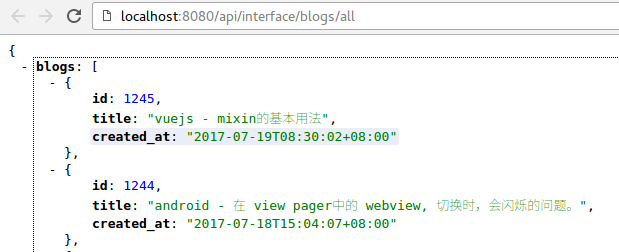

# 发送 http请求

很多时候我们需要在页面打开的时候,读取远程的内容,然后在当前页面显示.

这就需要用到 http请求了.

## vue页面调用http请求

vuejs 内置了对发送http请求的支持. 只需要在对应页面的script 标签内加上对应的代码就好.
例如:

我们新增一个页面,叫 "博客列表页" :  `src/components/BlogList.vue`, 内容如下:

```
<template>
  <div >
    <table>
      <tr v-for="blog in blogs">
        <td>{{blog.title }}</td>
      </tr>
    </table>
  </div>
</template>

<script>
export default {
  data () {
    return {
      title: '博客列表页',
      blogs: [
      ]
    }
  },
  mounted() {
    this.$http.get('api/interface/blogs/all').then((response) => {
       console.info(response.body)
       this.blogs = response.body.blogs
    }, (response) => {
       console.error(response)
    });
  }

}
</script>

<style >

td {
  border-bottom: 1px solid grey;
}
</style>
```

## 远程接口的格式

假设远程的接口,是:

http://siwei.me/interface/blogs/all

内容如下;

```
{
  blogs: [
    {
      id: 1245,
      title: "vuejs - mixin的基本用法",
      created_at: "2017-07-19T08:30:02+08:00"
    },
    {
      id: 1244,
      title: "android - 在 view pager中的 webview, 切换时，会闪烁的问题。",
      created_at: "2017-07-18T15:04:07+08:00"
    }
  ]
}
```

## 设置 vue　开发服务器的代理

正常来说， javascript在浏览器中是无法发送跨域请求的，所以我们需要在vuejs的＂开发服务器＂上做
个转发配置．

修改：  `config/index.js`文件，增加下列内容：

```
module.exports = {
  dev: {
    proxyTable: {
      '/api': {        // 1. 对于所有以  "/api"　开头的url 做处理．
        target: 'http://siwei.me',   // 3. 转发到 siwei.me 上．
        changeOrigin: true,
        pathRewrite: {
          '^/api': ''  // 2. 把url中的　"/api" 去掉．
        }
      }
    },
}
```

上面的代码做了三件事：

1. 对于所有以  "/api"　开头的url 做处理．
2. 把url中的　"/api" 去掉．
3. 把新的url 请求打到　siwei.me 上．

例如：　
- 原请求：　　http://localhost:8080/api/interface/blogs/all
- 新请求：　　http://siwei.me/interface/blogs/all

注意：　以上的代理服务器内容，只能在＂开发模式＂下才能使用．在生产模式下，只能靠服务器的nginx的
特性来解决js跨域问题．

重启服务器，可以看到我们的转发设置已经生效：

```
$ npm run dev
...
[HPM] Proxy created: /api  ->  http://siwei.me
[HPM] Proxy rewrite rule created: "^/api" ~> ""
> Starting dev server...
...

```

## 打开页面，查看http请求

我们接下来，访问  `http://localhost:8080/#/blogs/`

打开chrome developer tools, 就可以看到，"Network"中，已经有请求发出去了，截图显示了结果：


另外，我们也可以直接在浏览器中，输入要打开的链接，看到结果．(该浏览器使用了 json view插件)



## 把结果渲染到页面中．

我们发现，在export代码段中，有两个部分：

```
<script>
export default {
  data () { },
  mounted() { }
}
</script>

```
实际上，上面代码中，　

- `data`方法，是用于＂声明页面会出现的变量＂，并且赋予初识值，
- `mounted` 表示页面被vue渲染好之后的钩子方法，会立刻执行．

所以，我们要把发送http的请求，写到mounted方法中．（钩子方法还有created, 我们可以暂且认为
mounted方法与created方法基本一样，一般我们在Vue 2.0中都使用mounted. 后续会说到区别. ）


```
  mounted() {
    this.$http.get('api/interface/blogs/all').then((response) => {
       this.blogs = response.body.blogs
    }, (response) => {
       console.error(response)
    });
  }
```

上面代码中：

`this.$http` 中的
- this, 表示当前的vue组件（也即 BookList.vue)
- $http:  所有以 `$`开头的变量，都是vue的特殊变量，往往是vue框架自带． 这里的$http就是可以发起http
请求的对象.
- $http.get  是一个方法，可以发起get 请求．　只有一个参数就是目标url,
- then() 方法，来自于promise, 可以把异步的请求写成普通的非异步形式．
第1个参数是成功后的callback,
第2个参数是失败后的callback．
- `this.blogs = response.body.blogs` 中，是把远程返回的结果（json ），赋予到本地．　由于javascript
的语言特性，能直接支持json ，所以才可以这样写．

然后，我们有：

```
      <tr v-for="blog in blogs">
        <td>{{blog.title }}</td>
      </tr>
```

上面的代码中，　
- `v-for`是一个循环语法，可以把<tr>这个元素进行循环． 注意：这个叫directive,　指令，
需要跟标签一起使用．
- "blog in blogs": 前面的 `blog` 是一个临时变量，用于遍历使用．
后面的`blogs` 是http 请求成功后，　`this.blogs = ... ` 这个变量．
同时，这个`this.blogs` 是声明于　`data`钩子方法中．
- \{\{blog.title}} 用来显示每个blog.title的值

## 发起post请求


跟get特别类似，就是第二个参数是　请求的body.

```
    this.$http.post('api/interface/blogs/all', {title: '', blog_body: ''})
      .then((response) => {
        ...
      }, (response) => {
        ...
      });
```

官方文档：https://github.com/pagekit/vue-resource
