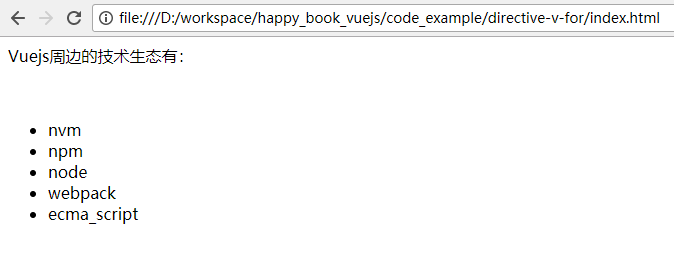
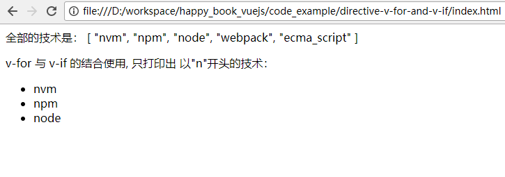
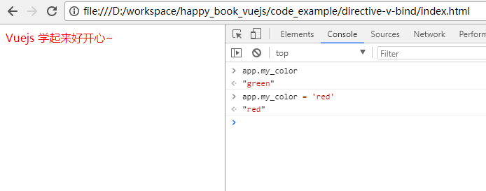
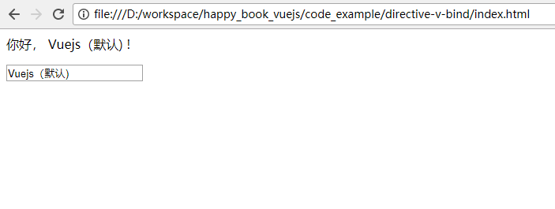
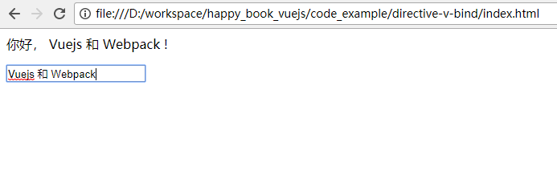
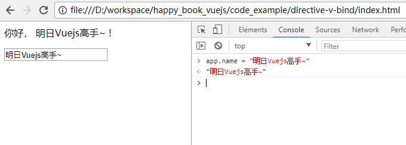

# 视图中的Directive (指令)

我们在学习java的时候，知道有jsp 页面， 对于.net语言，有 .asp, aspx页面， 对于ruby, 有erb这样的页面。

在Vuejs中，我们也有类似的编程能力。 

但是由于 Vuejs 是一种框架，所以它的稍微特殊一些，只能与标签做结合使用。 叫做Directive. (指令)

我们之前看到的 `v-on`, `v-bind` 等，以`v`开头的，都是Directive. 

原理： 

1. 用户在浏览器中输入网址，回车. 
2. 浏览器加载所有的资源（js, html内容。） 此时尚未解析。
3. 浏览器加载Vuejs  
4. Vuejs程序被执行， 发现 页面中的 `Directive`, 进行相关的解析
5. HTML中的内容被替换。 展现给用户。

所以，我们在开发一个Vuejs项目的时候，会看到大量的Directive。 这里的基础务必打好。

## 前提: 在directive中要使用表达式(Expression) 

- 表达式：  a > 1    （有效）
- 普通的语句：   a = 1  ; （这是个声明，不会生效）
- 流控制语句：  return a;  （不会生效）

在所有的Directive中，都只能使用表达式。

正确的：

```

<div v-if="a > 100">
</div>
```

错误的： 

```
<div v-if="return false">
</div>
```

## 循环: v-for

完整的例子如下：

```
<html>
<head>
	<script src="https://cdn.jsdelivr.net/npm/vue@2.5.16/dist/vue.js"></script>
</head>
<body>
	<div id='app'>
		<p>Vuejs周边的技术生态有： <p>
		<br/>
		<ul>
			<li v-for="tech in technologies">
				{{tech}}
			</li>
		</ul>
	</div>
	<script>
		var app = new Vue({
			el: '#app', 
			data: {	
				technologies: [
					"nvm", "npm", "node", "webpack", "ecma_script"
				]
			}
		})
	</script>
</body>
</html>
```

可以注意到，上面代码中的 `technologies`是在`data` 中被定义的： 

```
data: {	
	technologies: [
		"nvm", "npm", "node", "webpack", "ecma_script"
	]
}
```

然后在下面代码中， 被循环显示: 

```
<li v-for="tech in technologies">
	{{tech}}
</li>
```

用浏览器打开上面代码后，如下图所示： 



## 判断: v-if

条件Directive, 是由 `v-if`, `v-else-if`, `v-else` 配合完成的。 下面是个完整的例子： 

```
<html>
<head>
	<script src="https://cdn.jsdelivr.net/npm/vue@2.5.16/dist/vue.js"></script>
</head>
<body>
	<div id='app'>
		<p>我们要使用的技术是： <p>

		<div v-if="name === 'vuejs'">
			Vuejs !
		</div>
		<div v-else-if="name === 'angular'">
			Angular
		</div>
		<div v-else>
			React
		</div>		
	</div>
	<script>
		var app = new Vue({
			el: '#app', 
			data: {	
				name: 'vuejs'
			}
		})
	</script>
</body>
</html>
```

注意，

上面的代码中，  `v-if` 后面的引号中，是 `name === 'vuejs'`, `===` 是 Ecmascript 的语言， 表示严格的判断。 
（由于js的 `==` 有先天的缺陷，所以我们在95%的情况下， 都是用 三个等号的形式) 


用浏览器打开上面代码后，如下图所示： 


## v-if 与 v-for 的优先级

当 `v-if` 与 `v-for` 一起使用时，`v-for` 具有比 `v-if` 更高的优先级。 也就是说，Vuejs 会先执行 `v-for`, 再执行 `v-if` . 

下面是个完整的例子：

```
<html>
<head>
	<script src="https://cdn.jsdelivr.net/npm/vue@2.5.16/dist/vue.js"></script>
</head>
<body>
	<div id='app'>
		<p> 全部的技术是： {{technologies}} </p>
		<p> v-for 与 v-if 的结合使用, 只打印出 以"n"开头的技术： <p>
		<ul>
			<li v-for="tech in technologies" v-if="tech.indexOf('n') === 0">
				{{tech}}
			</li>
		</ul>
	</div>
	<script>
		var app = new Vue({
			el: '#app', 
			data: {	
				technologies: [
					"nvm", "npm", "node", "webpack", "ecma_script"
				]
			}
		})
	</script>
</body>
</html>
```

可以看到， 在下面的代码中， `v-if` 与 `v-for`结合使用了， 先是做了循环 `tech in technologies`，然后对当前的 循环对象 `tech` 做了判断： 

```
<li v-for="tech in technologies" v-if="tech.indexOf('n') === 0">
	{{tech}}
</li>
```

用浏览器打开上面代码后，如下图所示： 



## v-bind

`v-bind`指令用于把某个属性绑定到对应的元素的属性。 请看例子： 

```
<html>
<head>
	<script src="https://cdn.jsdelivr.net/npm/vue@2.5.16/dist/vue.js"></script>
</head>
<body>
	<div id='app'>
		<p v-bind:style="'color:' + my_color">Vuejs 学起来好开心~ </p>
	</div>
	<script>
		var app = new Vue({
			el: '#app',
			data: {
				my_color: 'green'
			}
		})
	</script>
</body>
</html>
```

在上面的代码中，可以看到， 通过 `v-bind`, 把`<p>`元素的style的值，绑定成了 `'color:' + my_color ` 这个表达式。 
当 `my_color` 的值发生变化的时候， 对应`<p>`的颜色就会发生变化。 

例如： 默认页面打开后， 是绿色的。 如下图所示：


如何知道变量`my_color` 已经绑定到了 `<p>` 上了呢？ 我们在 console中做修改， 让 `app.my_color = "red"`, 就可以看到对应的文字的颜色，变成了红色，
如下图所示：




## v-on

`v-on` 指令用于触发事件。  例如： 

```
<html>
<head>
	<script src="https://cdn.jsdelivr.net/npm/vue@2.5.16/dist/vue.js"></script>
</head>
<body>
	<div id='app'>
		{{ message }}
		<br/>
		<button v-on:click='highlight' style='margin-top: 50px'>真的吗</button>
	</div>

	<script>
		var app = new Vue({
			el: '#app', 
			data: {
				message: '学习Vuejs使我快乐~ '
			},
			methods:  {
				highlight: function() {
					this.message = this.message + '是的， 工资还会涨~!'
				}
			}

		})
	</script>
</body>
</html>
```

上面的代码中， 通过`v-on:click` 的声明，当 <button> 被点击(click)后，就会触发  `highlight` 这个方法。 

点击前的页面: 


点击后的页面: 


`v-on` 后面可以接HTML的标准事件， 例如： 

- click  （单击 鼠标左键）
- dblclick (双击鼠标左键)
- contextmenu (单机鼠标右键)
- mouseover  (指针移到有事件监听的元素或者它的子元素内)
- mouseout   (指针移出元素，或者移到它的子元素上)
- keydown   （键盘动作： 按下任意键) 
- keyup     (键盘动作： 释放任意键)

### v-on的简写

`v-on:click` 往往会写成 `@click`,   `v-on:dblclick` 也会写成 `@dblclick` , 所以同学们看代码的时候要了解~

## v-model 与双向绑定

`v-model` 往往用来做“双向绑定” ( two way binding) ， 这个双向绑定的含义是： 

1. 可以通过表单（用户手动输入的值） 来修改某个变量的值
2. 可以通过程序的运算 来修改某个变量的值， 并且影响页面的展示。 

双向绑定可以大大的方便我们的开发。 例如，我们做一个天气预报的软件时，需要在前台展示“当前温度”， 如果后台代码做了某些操作后，发现“当前温度”发生了变化，

如果没有双向绑定这个技术，我们的代码就会比较膨胀， 做各种条件判断。 有了双向绑定的话， 就可以做到后台变量一变化，前台的对于该变量的展示就会发生变化。 

下面是完整的页面源代码： 

```
<html>
<head>
	<script src="https://cdn.jsdelivr.net/npm/vue@2.5.16/dist/vue.js"></script>
</head>
<body>
	<div id='app'>
		<p> 你好， {{name}} ! </p>
		<input type='text' v-model="name" />
	</div>
	<script>
		var app = new Vue({
			el: '#app',
			data: {
				// 下面一行代码不能省略。 这里声明了 name 这个变量
				name: 'Vuejs（默认)'
			}
		})
	</script>
</body>
</html>
```

上面的代码中， 可以看到，我们: 

1. 使用了  `<input type='text' v-model="name" />`  来把 变量 `name` 绑定在了 `<input>` 这个输入框上（可以在这里看到`name`的值)
2. 使用了 `<p> 你好， {{name}} ! </p>` 来把变量 `name` 也显示在 页面上。
3. 在初始化中， 使用 `data: { name: '...' }` 的方式， 对变量 `name` 进行了初始化。

使用浏览器打开该html页面， 可以看到，最初的状态如下图所示： 



可以看到， 上图中的文字显示的是：  “你好， Vuejs! ”

然后，我们在输入框中，把内容改成：  “Vuejs 和 Webpack”, 于是页面就发生了变化，如下图所示：



这样就说明，我们通过输入框来改变某个变量的值，是成功的。  

然后，我们打开浏览器的“开发者工具”  （建议用Chrome, Chrome下的操作方式是： 按F12) 。 在console中输入： `app.name = "明日Vuejs高手"`, 
就会看到下图所示： 



这样就说明，我们通过运算来改变某个变量的值，是成功的。  


