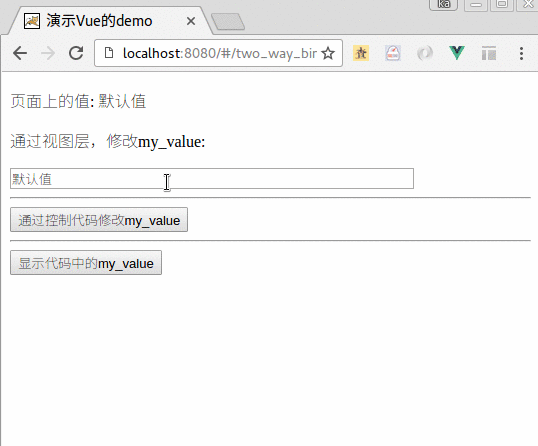
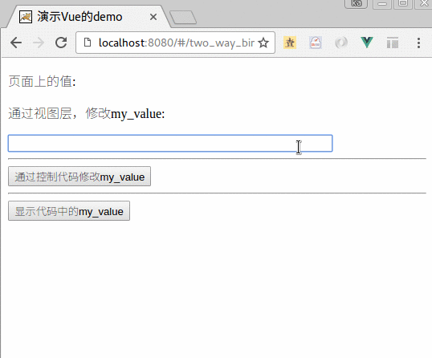

# 双向绑定

双向绑定这个概念在angular出现的时候,就作为王牌概念. 现在几乎是个js前端框架,就有这个功能.
它的概念是:

某个变量, 如果展现在页面上的话:

1. 如果在代码层面进行修改, 那么页面的值就会发生变化
2. 如果在页面进行修改(例如在input标签中), 那么代码的值就会发生变化.

## 一个演示例子.

在我们的项目中,增加一个 vue页面:  `src/components/TwoWayBinding.vue`

```
<template>
  <div>
    <!-- 显示　this.my_value 这个变量 -->
    <p>页面上的值:  {{my_value}} </p>

    <p> 通过视图层，修改my_value: </p>
    <input v-model="my_value" style='width: 400px'/>

    <hr/>
    <input type='button' @click="change_my_value_by_code()" value='通过控制代码修改my_value'/>
    <hr/>
    <input type='button' @click="show_my_value()" value='显示代码中的my_value'/>
  </div>
</template>

<script>
export default {
  data () {
    return {
      my_value: '默认值',
    }
  },
  methods: {
    show_my_value: function(){
      alert('my_value: ' + this.my_value);
    },
    change_my_value_by_code: function(){
      this.my_value += ",  在代码中做修改, 666."
    }
  }
}
</script>

```
上面代码中，　


然后,修改路由文件:  `src/router/index.js`:

```
export default new Router({
  routes: [
    {
      path: '/two_way_binding',
      name: 'TwoWayBinding',
      component: TwoWayBinding
    }
  ]
})
```


然后, 就可以访问路径:　`http://localhost:8080/#/two_way_binding`

效果１：通过页面，修改js代码的值：


效果２：通过代码层面的改动，影响页面的值：


所以，这个特性是Vuejs自带的。我们不需要刻意学它，只需要知道它可以达到这个目的，具备这个特性，就可以了。

以后我们会发现，Vuejs 等前端框架中，这种思想和现象特别常用。
